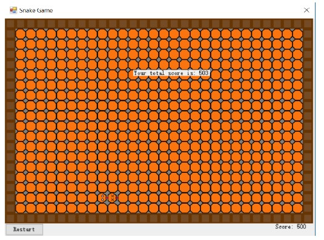

# Snake

The purpose of this program is to create an AI that can partially automate certain
parts of the playtesting phase in the game development
industry. The program is to reduce the
time and cost of the playtesting phase. The solution
program developed is chosen to be based on
a neural network and a genetic algorithm. Furthermore
a snake game is developed in order to
test the programs functionality. Two methods of
playtesting are successfully automated. However,
it is concluded that the program can only
be considered a proof of concept. This is due to
the programs lack of ability to handle complexity,
as well as the amount of implementation
required should the program be effectively used
on another game. Furthermore, if the program
was ever to be used on more complex games,
then the neural network and the genetic algorithm
would need to be significantly expanded
and large amount of computing power would be
necessary.

**A video of it completing snake:** https://www.youtube.com/watch?v=LkzVnO3fc9U&list=PLlS5RhZexhv1ki2NWbjrGetReNjHF0yM1&index=8
Trainning UI: https://www.youtube.com/watch?v=EvhLvM_PPw4

# Genetic algorithm - How to use this program

The object GeneticAlgorithm makes it possible to create a genetic algorithm which is able to solve a unique problem.

# What is required by the user for the algorithm to work?

Requirement 1: A class implementing the IFitnessCalculator which returns a class implementing the IFitnessInfo

The problem and a solution model should be defined in a class implementing the IFitnessCalculator interface. 
IFitnessCalculator requires the user to define the a method which returns a class implementing the interface IFitnessInfo containing the property Fitness, that represents how well the problem was solved. 
In the class that implements the interface IFitnessInfo, it is possible for the user to define uniqe properties to which the class implementing IFitnessCalculator can assign. The class implementing IFitnessInfo will be assigned to the property FitnessInfo in the Agent class, which makes it possible to access interesting information about the fitness calculation of that particular agent. 

Requrement 2: Defining own implementation of classes implementing the interfaces ISelection, ICrossover, IMutation. Alternatively the user can use classes from the library implementing the interfaces with some of the most common methods:

ISelection
- TopPerformersSelector
- TopPerformersPlusAllTimeBestSelector (not impl.)

ICrossover
- OnePointCombineCrossover

IMutation
- RandomResettingMutator

Requirement 3: Creating and using the GeneticAlgorithm class

To create a new instance of the class GeneticAlgorithm it is necessary to specify which settings the algorithm should use by creating and passing and instance of the class GeneticSettings. 

When the GeneticAlgorithm is instantiated, it contains a population of agents with randomized genes.
To use the algorithm, the user has to invoke one or more of the following methods on the GeneticAlgorithm: 

- CalculateFitness (takes a class implementing the IFitnessCalculator interface)
- MakeSelection (takes a class implementing the ISelctor interface. An exeption will be thrown if the user is trying to invoke the selection method on a population which has not been invoked with CalculateFitness first.
- MakeCrossover (takes a class implementing the ICrossover interface)
- MakeMutation (takes a class implementing the IMutator interface)

# Extra features
The user may have interest in accessing the following members: 

Class Agent: 
- TotalFitnessCalculations (represents number of fitness calculations in the lifetime of the genetic algorithm)

Class GeneticAlgorithm:
- AllTimeBestAgent (the best agent at the moment)
- AllTimeTopTenAgents (a list of the top ten performers)
- AllTimeTopTenAverageFitness (the average fitness value of the top ten performers above)

## Authors

- Adil Cemalovic
- Christian Damsgaard
- Magnus Lund
- Martin Lønne
- Simon Holst
- Søren Hjorth Boelskifte
